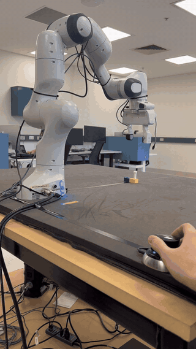
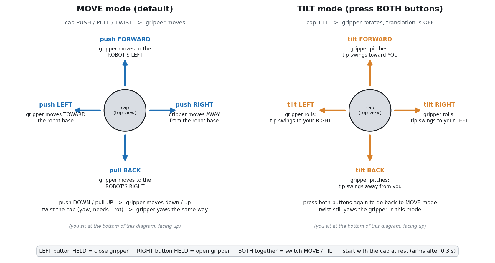

# SpaceMouse teleoperation of the Franka Panda: user manual



Move the Panda's gripper with a 3Dconnexion SpaceMouse Wireless. Push, pull and twist the cap to move (and rotate) the gripper; the two side buttons open and close the hand. The program `spacemouse_cartesian_teleop` runs on the Franka workstation and talks to the robot directly through libfranka. It needs no ROS and no Isaac Lab, and it is independent of `franka_control` and `xbox_teleop.py` (do not run them at the same time, only one program may control the arm).

## Quick start

1. **SpaceMouse:** plug it into the workstation with its USB cable (a USB hub is fine) and wake it by touching the cap. The Universal Receiver works too (tested 2026-09-22, see Troubleshooting for pairing); Bluetooth is untested. After the status flash at power-on the cap LED goes out, and that is the normal connected state.
2. **Robot:** in Desk (`https://172.16.0.2/desk/`) unlock the joints, **Activate FCI**, and release the user stop. Keep your hand on the user stop while the arm moves.
3. **Pose:** hand-guide the gripper so it points **straight down** over the work area, about (0.55, 0.00, 0.30) m in the robot base frame. See "Workspace and start pose".
4. **Check** without moving anything:
   ```bash
   cd ~/spacemouse_franka_teleop/build      # or wherever you built it
   ./spacemouse_cartesian_teleop --status
   ```
   You want `robot_mode=1 (Idle)`, a gripper axis within a few degrees of straight down, every joint margin above about 0.3 rad, and all six guard values at 1.00.
5. **Run:**
   ```bash
   ./spacemouse_cartesian_teleop --rot --wmax 0.15 --grip-force 10 --yaw-deg 90 --vmax 0.08 \
       --abs-box 0.40 0.65 -0.30 0.30 0.06 0.35 --max-seconds 0
   ```
   Leave the cap at rest until the status line shows `armed=1` (about 0.3 s), then start moving. Ctrl-C ramps the arm to a stop.

## Controls



The diagram is drawn as if you sit at the bottom of it, looking at the cap with "forward" pointing away from you.

### Move mode (default): translation and yaw

| Cap motion | Gripper moves (this bench, `--yaw-deg 90`) | In general |
|---|---|---|
| push **forward** (away from you) | to the **robot's left** (+y in the base frame) | in the direction set by `--yaw-deg` |
| pull **back** | to the **robot's right** (-y) | opposite of forward |
| push **right** | **away from the robot base** (+x) | 90 degrees clockwise (seen from above) from forward |
| push **left** | **toward the robot base** (-x) | 90 degrees counter-clockwise from forward |
| push **down** | down | down |
| pull **up** | up | up |
| **twist** clockwise / counter-clockwise (seen from above) | gripper **yaws** the same way (needs `--rot`) | same |

`--yaw-deg` is the direction, in the robot base frame, that cap-forward points to, measured counter-clockwise from the robot's forward axis (+x). `0` = away from the base, `90` = the robot's left, `180` = toward the base, `-90` = the robot's right. On this bench the operator's desk is on the robot's right, so cap-forward is the robot's left: `--yaw-deg 90`.

Speed: the response is quadratic. Full deflection gives `--vmax` (0.08 m/s recommended); half deflection gives a quarter of that. A gentle push is a few millimetres per second, good for fine positioning. There is a small dead zone around the centre, and the arm speeds up and slows down smoothly.

### Tilt mode: pitch and roll

A tilt of the cap looks like a push to the sensor (tilting forward gives almost the same readings as pushing forward), so tilts only count in **tilt mode**. Press **both side buttons together** to switch. In tilt mode translation is off, tilting the cap rotates the gripper about its tip, and twisting still yaws it. Press both buttons again to return to move mode. The status line shows `mode=move` or `mode=TILT`.

| Cap motion (tilt mode) | Gripper rotates |
|---|---|
| tilt **forward** | pitches: the tip swings **toward you** |
| tilt **back** | pitches: the tip swings **away from you** |
| tilt **left** | rolls: the tip swings to **your right** |
| tilt **right** | rolls: the tip swings to **your left** |

The gripper turns the same way the cap turns as a whole, so the tip swings opposite to the top of the cap. Top rotation rate is `--wmax` (0.15 rad/s, about 8.6 degrees per second). These directions were derived from the calibrated cap axes and checked in a dry-run; confirm them on your first low-speed rotation test, and if one feels backwards flip it with `--rot-signs` (three values for rotation about forward, left, up; `-1` flips one, for example `--rot-signs 1 -1 1`).

Translation and rotation are never active together: whichever the cap reading is stronger for wins, so a slightly sloppy twist does not move the gripper sideways.

### Gripper (side buttons)

- **Hold the left button** to close, **hold the right button** to open. One smooth move runs while the button is held and stops where you let go, so you choose the opening by when you release.
- If the fingers stop against an object while closing, the hand switches to holding it with `--grip-force` (default 10 N, allowed 1 to 40 N). The status line shows `hold=1`. Hold the right button to release.
- `--grip-speed` sets the finger speed (default 0.05 m/s). The status line shows `w=` (measured opening in metres).
- Pressing both buttons together only toggles tilt mode; it does not move the hand.

## Safety

| Protection | What it does |
|---|---|
| Arming | The cap must be at rest for 0.3 s before anything moves, so starting with the cap pushed does nothing. |
| Watchdog | If no cap report arrives for 0.5 s (cap asleep, cable pulled) the command drops to zero. |
| Speed and acceleration limits | Hard caps 0.20 m/s and 0.5 rad/s; smooth ramps. Ctrl-C, errors and the time limit all ramp to zero. |
| Workspace box | `--abs-box xmin xmax ymin ymax zmin zmax` in the robot base frame; speed tapers to zero over the last 3 cm before a wall. Without it, `--box-xy`, `--box-z-up`, `--box-z-down` set a box around the start pose. |
| Joint-limit guard | Estimates joint speeds from the robot's own Jacobian, slows motion toward any joint limit over 0.25 rad and stops 0.10 rad short. The status line shows it as `jl=` (1.00 free, 0.00 blocked). |
| Collision limits | Thresholds are set on the robot; a hard contact stops it with a reflex. |
| User stop | The real emergency stop. Ctrl-C is not one. |

## Workspace and start pose

The arm is reachable-limited by its joints, not just by the box. With the gripper pointing straight down and every joint at least 0.2 rad inside its limits, the gripper covers, in the robot base frame (work surface at z about 0.037 m):

- x from 0.40 to 0.65 m, y from -0.30 to +0.30 m, z from 0.06 to 0.35 m (the recommended `--abs-box`).
- Beyond x of about 0.70 m there is no straight-down solution, and below x of about 0.35 m the elbow runs out of room.
- Recommended start: gripper straight down at (0.55, 0.00, 0.30) m, q about [-0.008, 0.034, 0.008, -2.1, 0.0, 2.135, 0.786] rad (every joint at least 0.97 rad from its limit).
- The teleop keeps whatever orientation the gripper has when it starts. A 15 degree tilt already loses part of the box near the base and on the robot's left, and a nearly horizontal gripper (71 degrees from straight down) reached joint 6's end stop and aborted with a reflex. Tilt mode can be used to correct the orientation, and `--status` shows how far from straight down it is.

`reach_map.py` and `panda_reach.py` (Panda kinematics, checked against the robot's own reported pose to 0.3 mm) recompute the reachable area for other orientations.

## Options

Run `./spacemouse_cartesian_teleop <options>`. There is no `--help`; the table lists the ones you will use.

| Option | Default | Meaning |
|---|---|---|
| `--rot` | off | enable rotation (yaw always, pitch and roll in tilt mode) |
| `--yaw-deg` | 0 | direction of cap-forward in the base frame (90 on this bench) |
| `--vmax` | 0.05 m/s | speed at full deflection (max 0.20) |
| `--wmax` | 0.15 rad/s | rotation rate at full deflection (max 0.50) |
| `--abs-box xmin xmax ymin ymax zmin zmax` | off | absolute workspace box in the base frame |
| `--max-seconds` | 300 | stop after this time, 0 = no limit |
| `--grip-force` / `--grip-speed` | 10 N / 0.05 m/s | hold force and finger speed |
| `--no-gripper`, `--gripper-home` | | skip the hand entirely; run the hand's homing routine (moves the fingers) |
| `--rot-signs a b c` | 1 1 1 | flip a rotation direction with -1 |
| `--deadzone` | 20 | ignored raw counts around the centre (out of about 350) |
| `--recover` | off | clear a robot reflex at startup (does not move the arm) |
| `--status` | | read-only report: mode, pose, tilt, gripper, joint margins, guard values |
| `--dry-run` | | no robot connection; prints what would be commanded, with a simulated hand |
| `--ip`, `--device` | 172.16.0.2, auto | robot address; force a `/dev/hidrawN` |

The status line, printed five times a second, shows the raw cap values (`raw=`), the direction the program reads from them (`user[fwd left up]`, `ang=`), the commanded gripper velocity (`v_base=`), position (`pos_rel=`), `armed`, `jl`, `mode`, `grip_target`, `w`, `hold`, the button state `btn=` (1 left, 2 right, 3 both) and the age of the last cap report.

## Troubleshooting

| Symptom | Cause and fix |
|---|---|
| `no SpaceMouse motion interface found` | Cap not connected or asleep. Touch it, check the cable or receiver. Over a receiver, the cap must be paired to that receiver. `lsusb` showing `256f:c652` only proves the receiver is there, not that the cap is linked to it. |
| Receiver plugged in, but the cap never connects to it | The pairing was lost or the cap battery was flat. On a Windows machine with the receiver plugged in: charge the cap first, turn Bluetooth off, unplug the cap USB cable, open 3Dconnexion Settings, Advanced Settings, Universal Receiver, Add device, and follow the wizard (it says "Pairing Failed: taking too long to detect your device" if the cap is not awake). The pairing lives in the cap and the receiver, so afterwards the receiver works on any machine, with no app on the workstation. |
| Receiver works but auto-detect picks the wrong node | Over the receiver the motion arrives on the interface whose descriptor starts with vendor page `06 00 ff` (the program falls back to it automatically). Force a node with `--device /dev/hidrawN`; to see which node streams, read them with `xxd -l 64 /dev/hidrawN` while moving the cap. |
| `cannot open /dev/hidrawN: Permission denied` | The udev rule for vendor 256f is missing. Add `SUBSYSTEM=="hidraw", ATTRS{idVendor}=="256f", MODE="0666"` to `/etc/udev/rules.d/99-3dconnexion.rules` and reload udev (needs sudo). |
| `libfranka: Connection to FCI refused` | FCI is not activated. Activate it in Desk. |
| Program starts but nothing moves | The cap is not armed: release it fully for 0.3 s (`armed=0` in the status line), or the cap is asleep (`age` keeps growing). |
| Arm stops by itself at some place | Workspace box edge, or the joint-limit guard (`jl` near 0). Move back the other way; check with `--status`. |
| `Move command aborted: motion aborted by reflex` (`joint_position_limits_violation`) | A joint reached its limit, usually from a badly tilted gripper. Clear the reflex in Desk or restart with `--recover`, then bring the gripper close to straight down. |
| `robot_mode=4 (Reflex)` in `--status` | Same: clear it in Desk or use `--recover`. |
| Program prints `gripper unavailable` | The hand could not be reached. Check the hand is powered and the gripper connection is not used by another program. Use `--no-gripper` to drive the arm alone. |
| Hand jerky | Should not happen: it moves as one smooth move per button hold. If it does, note `--grip-speed` and tell the maintainer. |
| Rotation goes the wrong way | Flip it with `--rot-signs` (see the tilt section). |

## Status and known limits (2026-09-21)

- Tested on the real Panda over the USB cable: translation, gripper, the joint-limit guard and the absolute box. Rotation (yaw and tilt) is built and was checked in a dry-run; its directions on the real arm still need a low-speed check.
- The Universal Receiver was tested on the workstation on 2026-09-22 (after a re-pair): motion streams on the vendor-page interface and is auto-detected. The side buttons have not been checked over the receiver yet. Bluetooth has not been retested.
- The gripper action is a hold-to-move width; the Isaac Lab side (a width-target action for demonstrations) is not built yet.
- This program is separate from the Xbox teleop: the Xbox script sends poses to `franka_control` over ZMQ, while this one controls the arm directly through libfranka.

## Files

- `spacemouse_cartesian_teleop.cpp`, `CMakeLists.txt`: the program. Build: `mkdir -p build && cd build && cmake .. && make` (libfranka 0.9.2, Eigen3; the user needs realtime permission, see the suite README).
- `panda_reach.py`, `reach_map.py`: reachable-workspace calculation.
- `docs/`: the figure (`make_mapping_figure.py` redraws it) and the demo GIF.
